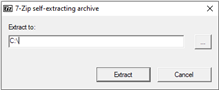

# Einfuehrung und Installation

<show-structure depth="2"/>

## Die C-Programmiersprache
C ist eine der ältesten Programmiersprachen. Sie wurde in den 70er-Jahren entwickelt und ist eine sehr maschinennahe Sprache, was sie sehr mächtig macht. C zu lernen ist eine gute Methode, um sich einen leichteren Zugang zu komplexeren Programmiersprachen zu ermöglichen. Das Wissen, das beim Lernen von C angeeignet wird, kann in fast jeder anderen Sprache nützlich sein.

## Installation
Um die C-Programmiersprache anwenden zu können, benötigt man zwei Dinge:

- Quelltext-Editor
- Compiler

### Editor
Wir benutzen Visual Studio Code als Quelltext-Editor. Dieser ist bereits bekannt aus dem Modul PowerShell. 

#### Extensions

- C/C++
- Code Runner

### Compiler
Als Compiler benutzen wir minGW (Windows 10): [Direkter Download](https://techdecodetutorials.com/downloads/mingw.exe)

#### Installationsvorgehen

1. Installation starten durch Doppelklicken auf die heruntergeladene Datei.
2. Den Dateipfad für die Installation ändern. 
3. Die Umgebungsvariablen-Einstellungen öffnen über die Windows-Suche.
4. In geöffneten Fenster auf `Umgebungsvariablen` drücken.
5. Die Variable `Path` auswählen und danach `Bearbeiten`.
6. Im neuen Fenster auf `Neu` klicken und den Pfad der Binaries des Compilers angeben.
7. Eingabeaufforderung öffnen und mit folgendem Befehl überprüfen, ob die Installation erfolgreich war:

```Shell
gcc --version
```

#### Installation überprüfen
Zuerst erstellt man ein neues File mit folgendem Code:

```C
#include<stdio.h>

int main()
{
    printf("Subscribe Now!");
    return 0;
}
```

Danach speichert man das File mit `Ctrl+S`. Oben rechts kann man den Code ausführen. Nun sollte im Terminal der Text `Subscribe Now!` angezeigt werden.

<seealso>
    <category ref="weitere">
        <a href="https://code.visualstudio.com/">Visual Studio Code</a>
        <a href="https://techdecodetutorials.com/download/">MinGW</a>
    </category>
</seealso>